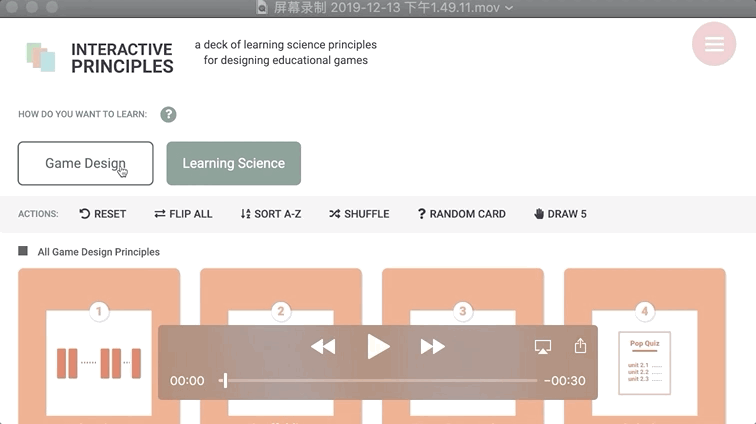
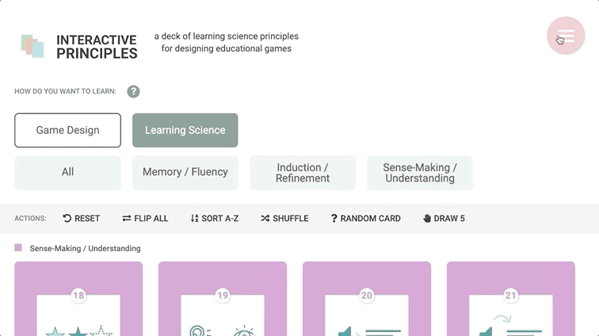
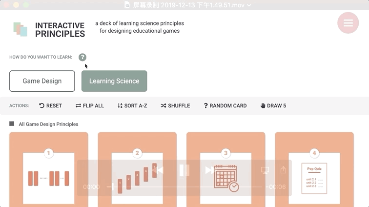

# Interactive Principles
A deck of learning science principles for designing transformational games


---
##### 2019.12.13 Update

Major updates:
1. Introduced two-factor menu system:
    - Game Design Component (new)
    - Learning Science Principles 


2. Updated sidebar menu
    
3. Added intro page:
    

* Package Structure
``` 
interactive-principles
├── README.md
├── package.json
├── package-lock.json
├── webpack.config.js
├── .gitignore
├── node_modules
├── config
├── public
│   ├── favicon.ico
│   ├── index.html
│   └── manifest.json
└── src
    ├── Components
    ├── image
    ├── styles
    ├── principles.json
    ├── intro.json
    ├── index.js
    ├── index.html
    ├── logo.png
    └── favicon.ico
```

## Developed With

* [Node.js 8.11](https://nodejs.org/en/) - Javascript runtime
* [React 16.4](https://reactjs.org/) - A javascript library for building user interfaces
* [Babel 6.26](https://babeljs.io/) - A transpiler for javascript
* [Webpack 4.x](https://webpack.js.org/) - A module bundler
* [SCSS](http://sass-lang.com/) - A css metalanguage

---

## Getting Started

Run the following commands to run this project on your local server. 
### Prerequisites

The following software is required to be installed on your system:

* Node 8.x
* Npm 3.x

Type the following commands in the terminal to verify your node and npm versions

  ```bash
  node -v
  npm -v
  ```

### Install

Follow the following steps to get development environment running.

* Clone _'interactive-principles'_ repository from GitHub

  ```bash
  git clone https://github.com/eharpste/interactive-principles.git
  ```

   _OR USING SSH_

  ```bash
  git clone https://github.com/eharpste/interactive-principles.git
  ```

* Install node modules

   ```bash
   npm install
   ```

### Build

#### Build Application

dev | prod
:---: | :---:
npm run build:dev | npm run build:prod

#### Build Application And Watch For Changes

dev | prod
:---: | :---:
npm run build:dev:watch | npm run build:prod:watch

#### Build Application With BundleAnalayzer Plugin Included

dev | prod
:---: | :---:
npm run build:dev:bundleanalyze | npm run build:prod:bundleanalyze

After running the above command, a browser window will open displaying an interactive graph resembling the following image:


### Run ESlint

#### Lint Project Using ESLint

  ```bash
  npm run lint
  ```

#### Lint Project Using ESLint, and autofix

  ```bash
  npm run lint:fix
  ```

### Run

#### Run Start

This will run the _'serve:dev'_ npm task

```bash
npm start
```

#### Run Dev Server

```bash
npm run serve:dev
```

#### Run Dev Server With Dashboard

```bash
npm run serve:dev:dashboard
```

The above command will display a dashboard view in your console resembling the following image:


#### Run Prod Server

This command will build application using production settings and start the application using _live-server_

```bash
npm run serve:prod
```

---

## Thanks

* **Douglas Minnaar** - *React Starter Project* - [drminnaar](https://github.com/drminnaar)

---

## Authors

* **Katie McTigue** - *Design + Dev* - [kaitlinmctigue.github.io](https://kaitlinmctigue.github.io/#/)
* **Cora Wang** - *Frontend Dev* - [www.corawang.net](https://www.corawang.net)
